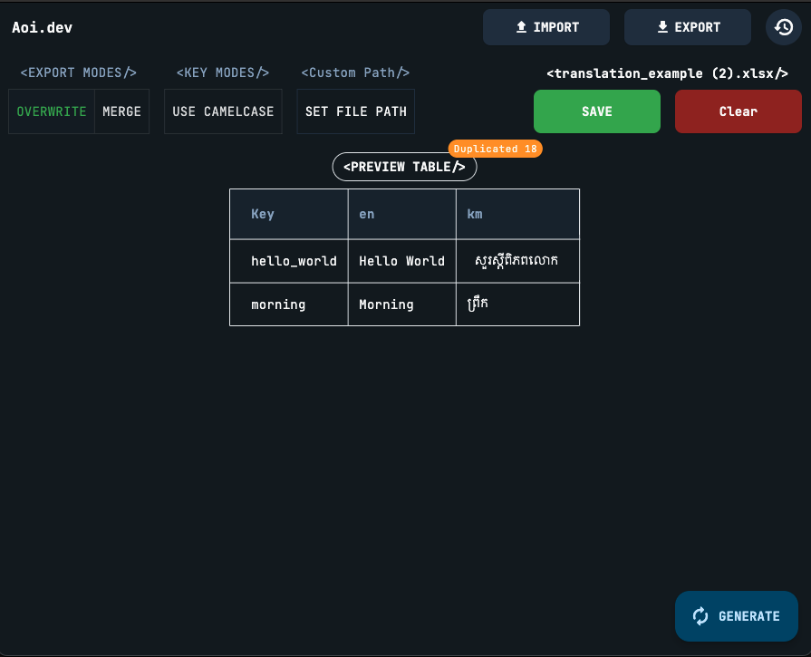

# Flutter JSON Localization Generator

A powerful desktop tool designed to streamline localization for your Flutter projects. Generate JSON files for the `easy_localization` package directly from a single Excel file, eliminating manual editing and saving you valuable development time.

## Demo

<div style="text-align:center; width: 100%;">
    
</div>


## 🚀 Key Features

* **📂 Direct Excel Import**: Instantly load all your app's translations from a single `.xlsx`/`.xls` file, or just drag & drop it onto the app.
* **📄 Sample Template**: Download a blank starter `.xlsx` template straight from the app if you don't have one yet.
* **✍️ Overwrite & Merge Export Modes**: Choose to fully **overwrite** existing JSON files, or **merge** new/edited translations into them while keeping untouched keys intact.
* **👀 Dual Preview**: Inspect data in a **Preview** tab (key -> per-language table, with empty cells and missing-key warnings highlighted) and a **Sheet** tab (raw imported spreadsheet).
* **⚠️ Duplicate Key Detection**: Automatically flags keys repeated within the same language column, with a drawer report showing the exact Excel row for each duplicate.
* **🌐 Auto-Translate Suggestions**: Auto-fill empty translation cells via machine translation based on your `en` column, then accept or reject each suggestion individually (or accept all per language).
* **🔤 Locale Key Generation**: Generates a `locale_keys.g.dart` file of `LocaleKeys` constants for `easy_localization`, supporting both camelCase/snake_case and nested classes for dotted keys (e.g. `home.title`).
* **🕘 Project History**: Every export is saved to a history list (name, Excel path, JSON/locale-key output paths) so you can reload and re-export a past project, or delete it.
* **💾 Persistent Export Path**: Set your export folder once, and the app remembers it for all future uses.
* **🖱️ Spam-Click Protection**: All buttons are debounced app-wide to prevent accidental duplicate actions (double exports, double deletes, etc.).
* **✨ Clean & Simple UI**: An intuitive interface that makes localization a breeze.
* **🗑️ One-Click Clear**: Reset the imported data with a single click to start fresh.

## 📚 Getting Started

### 1. Prepare Your Excel File

Your Excel sheet is the single source of truth. The structure is simple:

* The **first column** must be named `key`.
* Every other column header is treated as a **language code** (e.g., `en`, `de`, `fr`).

**Example** `translations.xlsx`:

| **key** | **en** | **es** | **fr** |
|---------|---------|---------|---------|
| `welcomeMessage` | Welcome! | ¡Bienvenido! | Bienvenue! |
| `goodbyeMessage` | Goodbye | Adiós | Au revoir |
| `loginButton` | Login | Iniciar Sesión | Connexion |

*Note: Empty cells are fine! They will be converted to empty strings in the JSON output.*

### 2. The Workflow

1. **Pick File**: Click `Pick File` and select your `.xlsx` translation file.
2. **Preview Data**: The app will instantly parse and display the keys and translations.
3. **Choose Export Location**: The first time, select a destination folder for your JSON files (e.g., `your_flutter_project/assets/translations`). This path will be saved for next time.
4. **Export**: Click `Export`. The tool generates a separate `.json` file for each language.

### 3. Generated Files

If you export to a folder named `assets/translations`, the tool will generate:

```
/assets/translations
├── en.json
├── es.json
└── fr.json
```

**Example** `en.json`:

```json
{
  "welcomeMessage": "Welcome!",
  "goodbyeMessage": "Goodbye",
  "loginButton": "Login"
}
```

## 🌐 Auto-Translate Suggestions

Missing a translation for a language? Hit **AUTO FILL** to machine-translate every empty cell based on the `en` column. Suggestions appear inline in the **Sheet** tab, highlighted so you can tell them apart from confirmed translations:

* ✓ Accept a single suggestion (turns it into a confirmed value).
* ✗ Reject a single suggestion.
* Use the column header badge to **Accept All** suggestions for that language at once.
* The whole run is cancelable while it's in progress.

## ⚠️ Duplicate Key Detection

If the same key appears more than once for a language while importing, the app doesn't silently overwrite it — it's flagged in a **Duplicate Keys** drawer, grouped by language, with the exact Excel row number for each occurrence. A live badge on the Preview tab shows the current duplicate count. By default, the first non-empty value for a key wins; a later duplicate only overwrites it if the existing value was empty.

## 🔤 Locale Key Generation

Alongside the translation JSON files, the app generates a `locale_keys.g.dart` file of `LocaleKeys` constants for use with `easy_localization`:

* Toggle **camelCase** / **snake_case** identifiers from the export mode bar.
* Dotted keys (e.g. `home.title`) are automatically grouped into **nested classes** instead of a flat list.
* Naming collisions are handled automatically (numeric suffixes), including the edge case where a key is both a leaf and a namespace (e.g. `home` and `home.title` both exist).

## 🕘 Project History

Every time you export, the current project (Excel source path, JSON output path, locale-key output path) is saved to a history list, accessible from the History icon in the app bar. From there you can:

* **Edit** — reload that project's Excel file and output paths back into the current session.
* **Delete** — remove it from history.

## 🔗 Integrating with `easy_localization`

### 1. Add Assets to `pubspec.yaml`

Make sure your Flutter project knows where to find the generated files.

```yaml
flutter:
  uses-material-design: true
  assets:
    - assets/translations/
```


runner
`dart run build_runner build `


